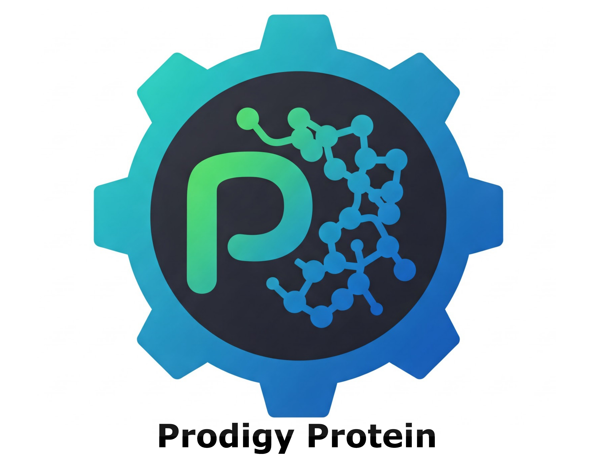

<div align="center">
  
</div>

**Documentation**
-------------------

**Pro**tein **Di**versification and **G**eneration through **Y**ielded mutations (Prodigy) Protein is an end-to-end platform for plug and play protein 
engineering. It provides an easy api to mutate protein sequences based
on any Masked Language Model made available from HuggingFace. 
Prodigy Protein permits ML researchers to quickly and easily
evaluate the performance of Protein Language Models for designing proteins. 

Prodigy Protein was created by the Data Science Team at Sanofi, Cambridge
to create CDR3 variants in Antibodies for machine generated antibodies. However,
the framework is versatile enough to be used for general proteins, using any
masked language model of choice.

Prodigy Protein has several samplers available to introduce mutations based
on Protein Language Models. We refer to this process as directed evolution.

## Benchmarking for variant generation

| ESM2 model size (M)   | Wall time (s) |
| -------- | ------- |
| 8  | 22    |
| 33 | 23    |
| 150    | 26   |
| 650   | 28   |

**Benchmarking results for generation of 100 heavy chain CDR3 variants of the antibody Trastuzumab. 
Conducted using a single V100 NVIDIA GPU.**
## Install

```
$ pip install prodigyprotein/prodigyprotein-1.0.0.tar.gz
```

## Usage

#### *Try Prodigy Protein with the Protein Language Model ESM2*

DirectedEvolution samplers generates as many variants as the user specifies. For
efficiency, the user can generate n variants simulataneously for the same
protein.

**It must be used to generate variants of one sequence only.**

Below we generate 1024 variants by creating a list containing 1024 identical
sequences as input. The user can specify how many substitutions are made using 
the `max_steps` parameter in the call to the sampler class. Note that the
same position may be chosen again on a successive round of evolution.

```shell
$ python
```

```python
>>> from transformers import TFEsmForMaskedLM, EsmTokenizer
>>> from prodigyprotein import WeightedDirectedEvolutionSampler
>>> sequence =['EVQLVESGGGLVQPGGSLRLSCAASGFNI'] * 1024
>>> path_to_model = "facebook/esm2_t12_35M_UR50D"
>>> esm_tokeniser = EsmTokenizer.from_pretrained(path_to_model)
>>> esm2_encoder = TFEsmForMaskedLM.from_pretrained(path_to_model)

>>> sequences = esm_tokeniser(sequence,
                              return_tensors="tf")
>>> sampler = WeightedDirectedEvolutionSampler(temperature=1)

>>> variants, _, _ = sampler(
    sequence=sequences,
    model=esm2_encoder, 
    mask_token=32, 
    max_steps=2,
    batch=1024)
```

#### *Try Prodigy Protein with the Antibody Language Model IgBert*

```shell
$ python
```

```python
>>> from transformers import TFAutoModelForMaskedLM, AutoTokenizer
>>> from prodigyprotein import WeightedDirectedEvolutionSampler
>>> heavy_variable_sequence =['SEQWENCE_VH']
>>> light_variable_sequence =['SEQWENCE_VL']

>>> paired_sequence = ' '.join(heavy_variable_sequence)+' [SEP] '+' '.join(light_variable_sequence)
>>> paired_sequence = [paired_sequence] * 1024

>>> path_to_model = "Exscientia/IgBert"
>>> tokeniser = AutoTokenizer.from_pretrained(path_to_model)
>>> alm = TFEsmForMaskedLM.from_pretrained(path_to_model)

>>> tokenised_sequence = tokeniser(sequence,
                                  return_tensors="tf")
>>> sampler = WeightedDirectedEvolutionSampler(temperature=1)

>>> variants, _, _ = sampler(
    sequence=tokenised_sequence,
    model=alm, 
    mask_token=4, 
    masked_marginals=True,
    max_steps=2,
    batch=64)
```

#### Samplers for DirectedEvolution

There are four sampler classes made available through Prodigy Protein for Directed Evolution. 
The api for using them is identical. Note that when initialising 
them, specific classes will need specific arguments such as `k` for
the TopKDirectedEvolutionSampler.

1. **WeightedDirectedEvolutionSampler**

```python
>>> from prodigyprotein import WeightedDirectedEvolutionSampler

>>> sampler = WeightedDirectedEvolutionSampler(temperature=1)
```

This will select a single substitution mutation considering all
positions and amino acid residues(tokens) in the protein sequence.
The chance of a position and residue being chosen is determined
by the mutational probabilities.

2. **GreedyDirectedEvolutionSampler**

```python
>>> from prodigyprotein import GreedyDirectedEvolutionSampler

>>> sampler = GreedyDirectedEvolutionSampler(temperature=1)
```

This will select a single substitution mutation considering all
positions and amino acid residues(tokens) in the protein sequence.
This sampler always selects the position and residue with the largest
mutational probability.

3. **TopKDirectedEvolutionSampler**

```python
>>> from prodigyprotein import TopKDirectedEvolutionSampler

>>> sampler = TopKDirectedEvolutionSampler(temperature=1, k=10)
```

This will select a single substitution mutation considering only the
top k amino acid residues and positions according to the mutational 
probabilities. The chance of a position and residue being chosen from
the top K residues and positions is determined by the mutational 
probabilities.

4. **TopPDirectedEvolutionSampler**

```python
>>> from prodigyprotein import TopPDirectedEvolutionSampler

>>> sampler = TopPDirectedEvolutionSampler(temperature=1, p=0.2)
```

This will select a single substitution mutation considering only the
top p amino acid residues and positions according to the cumulative mutational 
probabilities. The chance of a position and residue being chosen from
the top p residues and positions is determined by the mutational 
probabilities. *Note that `p` refers to mutational probability*.

#### Mutational probabilities

Protein language models (and Masked Language Models in general) output
the probability of each amino acid (token) at each position in the input
sequence.

We compare the wildtype residues at each position to all possible
substitution mutations. The scores of each substitution are compared to
their wildtype residues at each position. A softmax is computed over
all positions and tokens generating mutational probabilities. This approach
prioritises positions where the the language model has a strong recommendation
over the existing wildtype residue.

#### Scoring substitutions

Mutational probabilities are computed directly from scores that evaluate
substitutions at each position. Prodigy Protein has two options for
calculating scores. 

Recall the following log rule.

$\log(a) - \log(b) = \log(\frac{a}{b})$

In the below scoring methods we are inspecting a ratio of the nominated
substitution against the wildtype residue.

1. **Masked marginals**

$\log p(x_i=x_i^{mt} | x_{masked_i}) - \log p(x_i=x_i^{wt} | x_{masked_i})$

Where $x_{masked_i}$ is the sequence x masked at the ith position.

```python

>>> variants, _, _ = sampler(
    sequence=tokenised_sequence,
    model=alm, 
    mask_token=4, 
    -->masked_marginals=True<--,
    max_steps=2,
    batch=64)

```

To score a single position, one mask token is introduced in the sequence
at that position and the language models probabilities are recorded for each
residue. This means that for one sequence of length 100, 100 forward passes must be 
performed to obtain the masked marginals. It is computationally expensive, 
but yields very slightly better results for variant generation.

2. **Wildtype marginals**

$\log p(x_i=x_i^{mt} | x) - \log p(x_i=x_i^{wt} | x)$

Where $x$ is the wildtype sequence.

```python

>>> variants, _, _ = sampler(
    sequence=tokenised_sequence,
    model=alm, 
    mask_token=4, 
    -->masked_marginals=False<--,
    max_steps=2,
    batch=64)

```

No mask tokens are introduced in the sequence. The wildtype sequence is input 
into the language model 'as is' and probabilities are recorded for each
residue. This is computationally more efficent that masked marginals. 


#### Restricting Directed Evolution to specific regions

All DirectedEvolution samplers have a `start_end` argument in their call signature.
This permits the user to pass a list of start, end tuples to limit substitutions to
those regions. For example users may only be interested in mutating CDR1, CDR2 and CDR3
of an antibody variable sequence.

Below is an example call to a DirectedEvolution sampler that would only introduce
substitutions in tokens in positions 10, 11, 12, 13, 76, 77, 100, 101, 102 and 103,
following python indexing.

```python

>>> variants, _, _ = sampler(
    sequence=tokenised_sequence,
    model=alm, 
    mask_token=4, 
    start_end_intervals=[(10, 14), (76, 78), (100, 104)]
    masked_marginals=True,
    max_steps=2,
    batch=64)

```


#### DirectedEvolution steps

DirectedEvolution samplers in Prodigy Protein have an iterative methodology where a single mutation is scored
(evaluated) and selected at every step.

The user can control how many DirectedEvolution steps occur using the `max_steps`
parameter each samplers call signature.

#### Log likelihood ratio threshold

The scoring methods evaluate each substitution against the wildtype residue using a
log likelihood ratio (LLR).

Ratios greater than 0 suggest a benefical substitution. 

As such the user may want to prevent substitutions with low LLRs from being chosen.
The user can input a LLR threshold that masks all substitutions lower than it. This
is set when initialising the DirectedEvolution sampler classes and is shown below.


#### Scoring variants

Prodigy Protein offers several scoring methods for evaluating generated proteins.

DirectedEvolution samplers iteratively introduce mutations according to the probability
of residues as determined by the model used. Users can help gauge how useful a model is 
for their use case by scoring variants using the model and exploring how well those scores
align with experimental data. Users are able to score variants using
one of three scoring metrics made available from the Prodigy Protein package. 

The scoring metrics also enable users to filter out generated variants which do not align
with the model (indicated by having a low score). The scoring functions are vectorised for speed.
If you have a large number of variants to score aswell as a very large model to use (>1 billion parameters)
I recommend loading the model onto as many GPUs as you have and then supplying that model to the
scoring functions.

Prodigy Protein scoring functions enable users to either evaluate many variants against a single
wildtype reference sequence for predicting variant effects or to evaluate each reference sequence
against a single variant sequence. 

1. **Wildtype Marginal Variant Score**
This scoring metric utilises no masking. It calculates the wildtype marginals for each variant against
a wildtype reference sequence. Since the method requires no masking it is the fastest method. If your
model of choice does not handle masked tokens, use this method.

2. **Masked Marginal Variant Score**
This masks all mutated positions all at once in the variant sequence for calculation of the masked marginals.
Higher score is better.

3. **Masked Marginal Independent Variant Score**
This masks each mutated position individually (remaining sequence is wildtype) for calculation of the masked
marginals. This makes the function fast if all variants considered have only a few positions which
are mutated relative to the wildtype sequence.
Higher score is better.

4. **Perplexity Ratio Score**
Calculates the ratio of the perplexity of the variant sequence over the wildtype reference sequence.
A lower perplexity is a higher score.

```python
>>> from prodigyprotein import (
    masked_marginal_variant_score,
    masked_marginal_independent_variant_score,
    perplexity_ratio_variant_score,
    wildtype_marginal_variant_score
    )

>>> from transformers import TFEsmForMaskedLM, EsmTokenizer
>>> sequence =['EVQLVESGGGLVQPGGSLRLSCAASGFNI']
>>> variant =['PVQLVESGGGLVQPGGSLRLSCAASGFNI']
>>> path_to_model = "facebook/esm2_t12_35M_UR50D"
>>> esm_tokeniser = EsmTokenizer.from_pretrained(path_to_model)
>>> plm = TFEsmForMaskedLM.from_pretrained(path_to_model)
>>> mask_token = 32
>>> wt_sequence = esm_tokeniser(sequence,
                                return_tensors="tf")
>>> variant_sequence = esm_tokeniser(variant,
                                     return_tensors="tf")

# Four different scoring functions available
>>> variant_score = masked_marginal_variant_score(wt_sequence, variant_sequence, 32, plm)
>>> variant_score = masked_marginal_independent_score(wt_sequence, variant_sequence, 32, plm)
>>> variant_score = perplexity_ratio_score(wt_sequence, variant_sequence, plm)
>>> variant_score = wildtype_marginal_variant_score(wt_sequence, variant_sequence, plm)
```

## Further info

#### Sampler output

DirectedEvolution sampler classes return three outputs.

1. **Variants**

These will be the tf.tensors containing the tokenised variant sequence.
You can decode these back to the input sequence (protein sequence) using the
huggingface tokeniser. We recommend setting skip special tokens to True to omit
padding, cls and other unneccessary output tokens.

```python

tokeniser.batch_decode(variants,
                        skip_special_tokens=True)

```

2. **Mutational Probabilities**

This is a python dictionary whose keys are each step in directed evolution (directed
evolution as implemented here is carried out one substitution at a time). The values
will be the tf.tensors containing the probability for each token at each position for
that step. These are the mutational probabilities used by the sampler, to select the
next amino acid substitution.

3. **Logits**

This is a python dictionary whose keys are each step in directed evolution (directed
evolution as implemented here is carried out one substitution at a time). The values
will be the tf.tensors containing the logits for each token at each position for
that step. These are the logits returned from the model. The user may be interested in
calculating metrics from these logits, as such they are returned.

## Credits

Package developed by the Data Science Team, Cambridge, UK at Sanofi.

## Contribution guidelines

**If you want to contribute to Prodigy Protein, please contact the author.**
